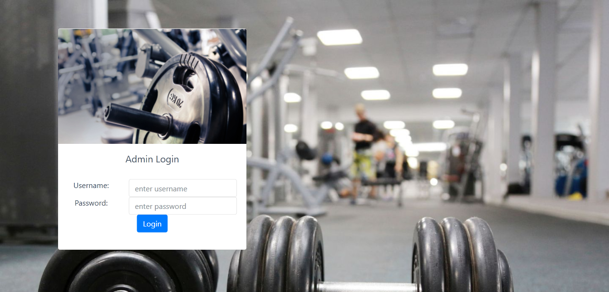
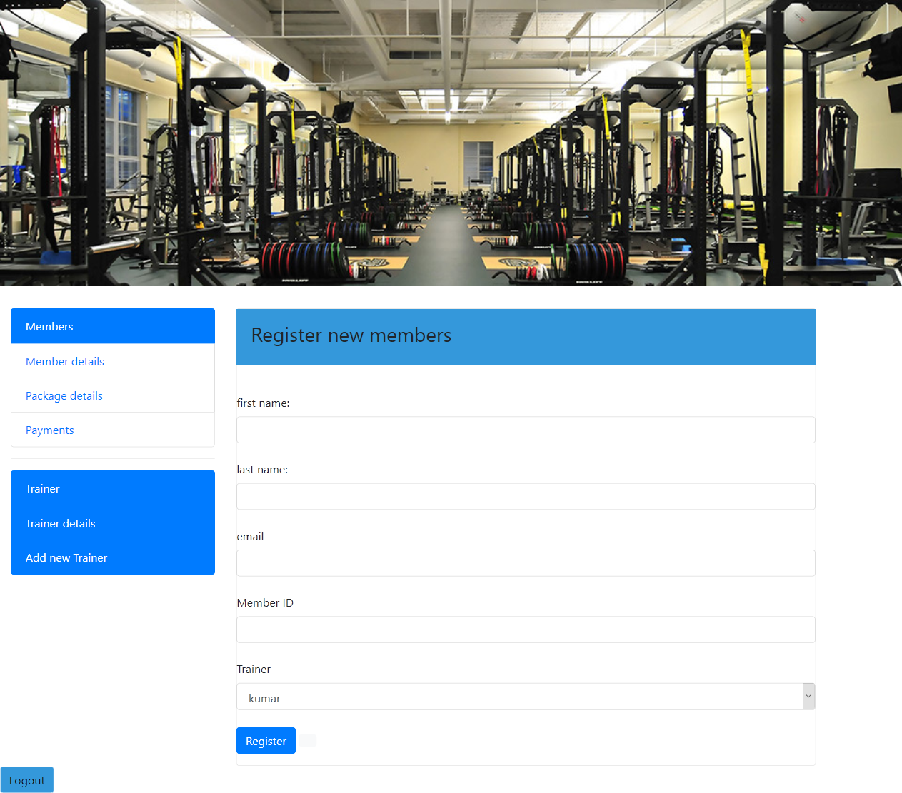

# Gym-management

To develop easy to use software which handles the customer staff relationship in an
effective manner. To develop a user-friendly system that requires minimal user
training. Most of features and function are similar to those on any windows platform.

